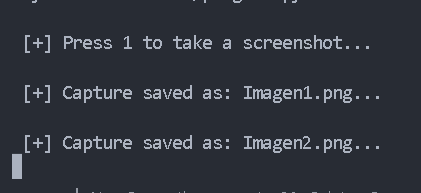

# Script-Python-Screenshot

Project #2 with Python. Take screenshots.

Hitting the one key in the program takes a full screenshot, 
and saves it to the images folder within the program directory.

**Image 1**

**Image 2**

**Best regard !!!**

<cite>Author: Francisco Velez</cite>
